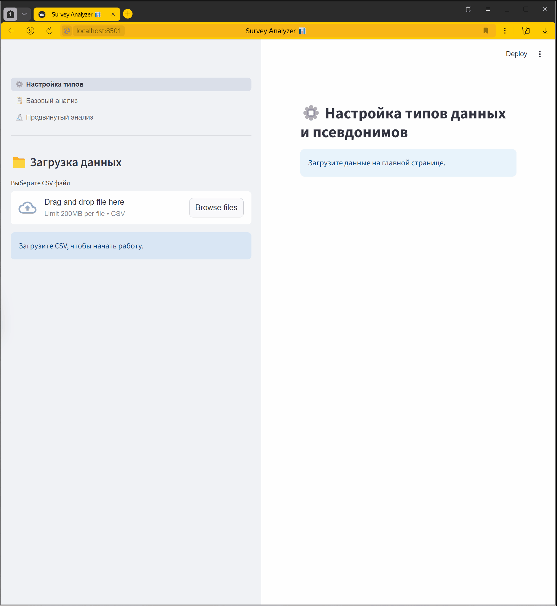
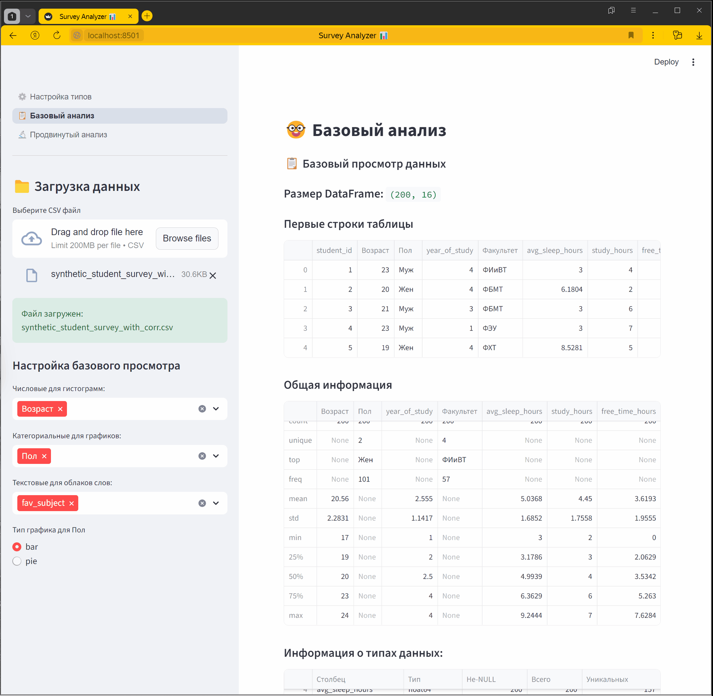
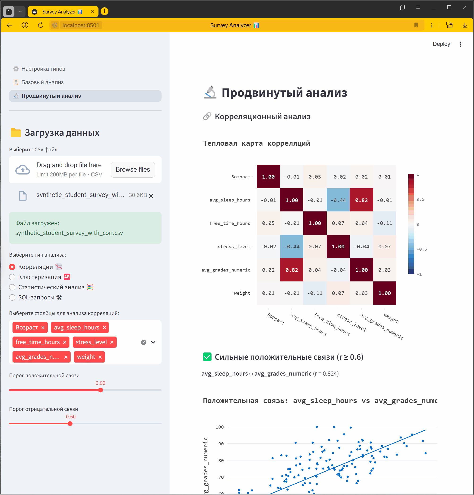
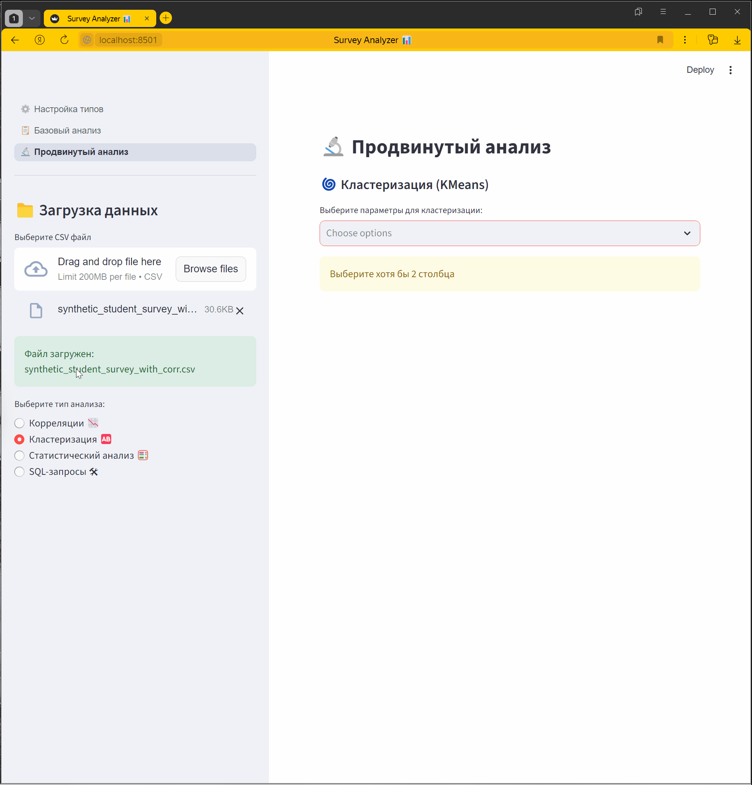
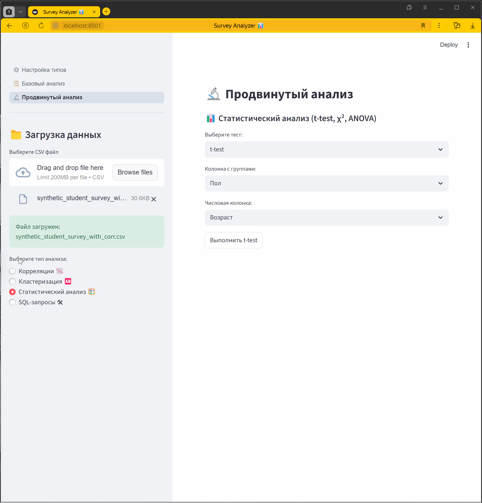
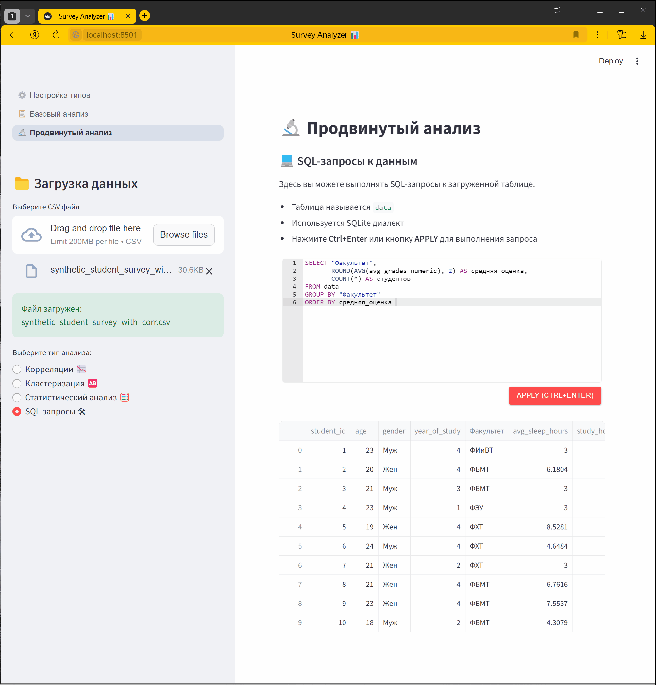

# 📊 Insight Forms

**Надоело вручную разбирать выгрузки Google Forms и Яндекс.Форм в Excel?**

Insight Forms — интерактивное Streamlit-приложение, которое за пару минут превращает сырой CSV из опросов в наглядные
графики, корреляции, кластеры и статистику. Без Excel, без формул, без ручной работы.

**🔗 Приложение:** [insight-forms.streamlit.app](https://insight-forms.streamlit.app/)

---

## ✨ Возможности

- **⚙️ Настройка типов и псевдонимов** — автоопределение типов столбцов (количественный / категориальный / текстовый /
  игнорировать), переименование с валидацией дублей.
- **📋 Базовый анализ** — размер датасета, описательная статистика, гистограммы, bar/pie-диаграммы, облака слов,
  группировка по категориям.
- **🔬 Продвинутый анализ**:
    - корреляционный анализ с heatmap и scatter-графиками сильных связей;
    - кластеризация KMeans с автоподбором `k` через silhouette score;
    - статистические тесты: t-test (Уэлча), χ², ANOVA;
    - SQL-запросы к данным через встроенный редактор (SQLite).

---

## 🚀 Установка и запуск

### 1. Клонировать репозиторий

```bash
git clone <URL>
cd insight-forms
```

### 2. Создать виртуальное окружение

```bash
# Windows
python -m venv .venv
.venv\Scripts\activate

# Linux / macOS
python3 -m venv .venv
source .venv/bin/activate
```

### 3. Установить зависимости

```bash
pip install -r requirements.txt
```

### 4. Запустить приложение

```bash
streamlit run app.py
```

Приложение откроется в браузере по адресу `http://localhost:8501`.

---

## 📖 Как пользоваться

### ⚙️ Настройка типов



*Автоопределение типов, переименование столбцов, проверка дублей.*

### 📋 Базовый анализ



*Гистограммы с группировкой, bar/pie-диаграммы, облака слов.*

### 🔬 Продвинутый анализ

**Корреляции** — heatmap + scatter с OLS-трендом для сильных связей:



**Кластеризация** — KMeans с автоподбором `k` через silhouette score:



**Статистика** — t-test (Уэлча), χ², ANOVA с box-plot:



**SQL** — запросы к данным через встроенный редактор SQLite:



### Типы столбцов

| Тип                | Поведение                                                       |
|--------------------|-----------------------------------------------------------------|
| **Количественный** | Доступен в гистограммах, корреляциях, кластеризации, статистике |
| **Категориальный** | Доступен в bar/pie-графиках, используется как группирующий      |
| **Текстовый**      | Доступен для облака слов                                        |
| **Игнорировать**   | Исключается из всех разделов, кроме SQL                         |

---

## 🗂 Структура проекта

```
insight-forms/
├── app.py                   # Точка входа: настройка + навигация + загрузка CSV
├── type_config.py           # Конфигурация типов и переименование столбцов
├── basis_analysis.py        # Страница базового анализа и визуализаций
├── advanced_analysis.py     # Корреляции, кластеризация, статистика, SQL
├── plot_styles.py           # Единые стили Plotly
├── requirements.txt         # Прямые зависимости
└── README.md
```

---

## 🛠 Стек

- **Streamlit** — веб-фреймворк для data-приложений;
- **Plotly** — интерактивные графики;
- **pandas / numpy** — работа с данными;
- **scikit-learn** — KMeans, StandardScaler, silhouette;
- **scipy / statsmodels** — статистические тесты и OLS-тренд;
- **wordcloud + matplotlib** — облака слов;
- **streamlit-ace + sqlite3** — SQL-редактор.

---

## 📦 Зависимости

Указаны в `requirements.txt`. Прямые зависимости:

```
streamlit
streamlit-ace
pandas
numpy
plotly
matplotlib
wordcloud
scikit-learn
scipy
statsmodels
```

Остальные (altair, pyarrow, Jinja2 и т.д.) подтягиваются автоматически как транзитивные.

---

## 📋 Требования к CSV

- Формат: **CSV с разделителем-запятой**, кодировка **UTF-8** (для корректной работы с кириллицей).
- Первая строка — заголовки столбцов.
- Пустые значения допускаются (обрабатываются как `NaN`).
- Приложение само определит типы столбцов, но их можно изменить вручную.

---

## 📄 Лицензия

Проект создан в учебных/личных целях. Используйте свободно.